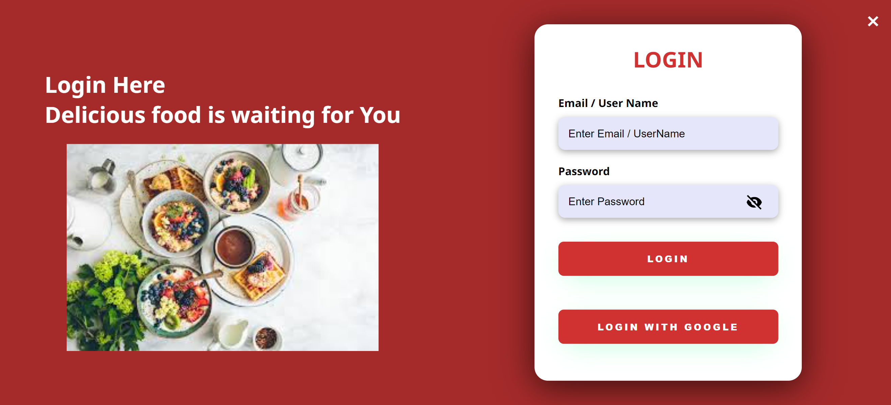

<div align="center">
   
   
   
   
   
<h1 >Food Ordering Website</h1>

<br>

 &nbsp;
 &nbsp;
<a href="https://github.com/khushi-joshi-05/Food-ordering-website"></a> &nbsp;
<a href="https://github.com/khushi-joshi-05/Food-ordering-website/stargazers"></a> &nbsp;
<a href="https://github.com/khushi-joshi-05/Food-ordering-website/network/members"></a> &nbsp;
 &nbsp;
 &nbsp;
 &nbsp;  
<a href="https://github.com/khushi-joshi-05/Food-ordering-website/blob/main/LICENSE"></a>&nbsp;
<a href="https://github.com/khushi-joshi-05/Food-ordering-website/issues"></a>&nbsp;
<a href="https://github.com/khushi-joshi-05/Food-ordering-website/issues?q=is%3Aissue+is%3Aclosed"></a>&nbsp;
<a href="https://github.com/khushi-joshi-05/Food-ordering-website/pulls"></a>&nbsp;
<a href="https://github.com/khushi-joshi-05/Food-ordering-website/pulls?q=is%3Apr+is%3Aclosed"></a> &nbsp;

</br>
</div>

Foodie is a food ordering website that aims to provide users with a seamless experience for ordering food online, taking orders for pickup, and booking tables for dining in. The website showcases the quality and specialities of the food offered, along with a variety of services to cater to different user preferences.

This repository is aimed to help people to contribute in open source and learn Git and GitHub.

## Key Features

- **Order Online**: Users can easily browse through the menu and place orders for delivery.
- **Take Order**: Customers can also choose to place orders for pickup.
- **Book Table**: For those who prefer dining in, the website offers the option to book a table in advance.
- **Menu**: The menu section provides a comprehensive list of food items available for order, along with descriptions and prices.
- **App Details**: Information about any associated mobile applications for easy access to the service.
- **Contact Page**: A dedicated contact page for users to reach out for inquiries, feedback, or support.

## Technologies Used

- **HTML**: Markup language for structuring web pages.
- **CSS**: Styling language for designing the visual layout of web pages.
- **JavaScript**: Programming language for adding interactivity and functionality to web pages.
- **GitHub Pages**: Hosting service for publishing the frontend code.

## Development Steps

1. **Planning and Design**:

   - Defined UI requirements based on user needs and business goals.

2. **HTML Structure**:

   - Developed web page structure using HTML elements.
   - Organized content into logical sections like header, navigation, main content, and footer.

3. **CSS Styling**:

   - Styled HTML elements to create visually appealing design.
   - Implemented responsive design for compatibility across various devices.

4. **JavaScript Interactivity**:
   - Enhanced user interaction with dynamic features like menu filtering and form validation.

## Tech Stack

- **Frontend**: HTML, CSS, JavaScript (for user interface and interactivity)
- **Database**: MongoDB (for storing user data, orders, etc.)~~~~ need to be implemented
- **Responsive Design**: Ensuring compatibility across various devices and screen sizes.

## How to Run Locally

1. Clone the project repository:

```bash
git clone https://github.com/khushi-joshi-05/FoodOrderingWebsite.git
```

2.Navigate to the project directory:

```
cd FoodOrderingWebsite
```

3.Open the index.html file in your preferred web browser to view the website locally.

## Screenshots

These are some snapshots of the project.




## License

[MIT](https://choosealicense.com/licenses/mit/)

This project is licensed under the MIT License - see the LICENSE file for details.
